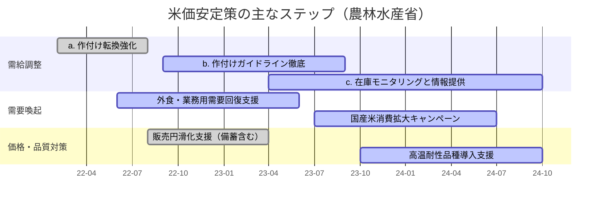

# 2022年以降の米価格問題（農林水産省情報に基づく調査まとめ）

## 本文の前提
- 参照先はすべて農林水産省が公開する資料・ページに限定。
- 価格は主に農林水産省が公表する「相対取引価格」の情報を用いる（60kg 当たり価格）。
- 2022年以降の米価の課題は、需要減（外食・業務用の回復遅れ）、生産量の調整遅れ、在庫水準、国際穀物市況の影響など、農林水産省の分析に基づく。

## 最新情報にアクセスできる公式リンク
- 相対取引価格の月次速報（米穀取引価格）：<https://www.maff.go.jp/j/seisan/keikaku/kome/souba/index.html>
- 米穀の需給関係・在庫推移（需給情報）：<https://www.maff.go.jp/j/seisan/keikaku/kome/jyuukyu/index.html>
- 米政策の基本方針（需要に応じた生産・販売への取り組み）：<https://www.maff.go.jp/j/seisan/keikaku/kome/senryaku/index.html>
- 外食・中食向け需要対策（業務用米確保緊急対策等の通知）：<https://www.maff.go.jp/j/seisan/keikaku/kome/gyomu/index.html>
- 生産調整・転作関連の情報（需要に応じた生産）：<https://www.maff.go.jp/j/seisan/keikaku/kome/kanren/index.html>
- 需要見通しと作付け方針（毎年度の見直し資料）：<https://www.maff.go.jp/j/seisan/keikaku/kome/sakuduke/index.html>

各リンクでは、月次の価格グラフや在庫量、作付け方針などが更新される。ブックマークしておくと最新データへ直接アクセスできる。

## 2022年以降の主要な経緯

| 年度 | 農林水産省が把握した主な状況 | 政策対応の要点 | 資料例（農林水産省） |
| --- | --- | --- | --- |
| 2022年（令和4年産） | コロナ禍後の外食・業務用需要が回復途上で、主食用米の需要が想定より弱く、過剰在庫が重石に。相対取引価格は2021年並みの弱含みで推移。 | 作付け転換支援（麦・大豆・飼料用米等へのシフト）、需要喚起キャンペーン。 | 「相対取引価格（令和4年産）」速報・農林水産省プレス資料 |
| 2023年（令和5年産） | 作付け調整が進み、在庫の圧縮が進行。相対取引価格は下げ止まり～緩やか反発。業務用向け需要は回復傾向。 | 販売円滑化支援、需要回復に合わせた作付けガイドラインの徹底。 | 「令和5年産主食用米の需給・価格動向について」等 |
| 2024年（令和6年産） | インバウンド回復で外食需要は増加。ただし生産コスト上昇・気象リスクが価格に波及。需給はおおむね均衡方向。 | 気象リスクへの備え（高温耐性品種導入）、在庫監視の継続。 | 「令和6年産主食用米の作付けのポイント」等 |

> 各年度の具体的な価格推移は、上記「相対取引価格の月次速報」ページでPDF/Excelとして提供される。

## 米価問題の要因整理（農林水産省資料をベースに抜粋）

- **需要側**
  - 外食・業務用需要：コロナ禍で急落。2023年以降は回復傾向だが、品種・粒形の要望が変化。
  - 家庭用需要：巣ごもり需要の反動で2022年に鈍化し、販売競争が激化。
- **供給側**
  - 生産量：2021年度までの作付け減少が十分でなく、2022年に在庫が積み上がった。
  - 気象：高温・多雨による品質懸念が一部産地で発生。
- **コスト・市況要因**
  - 肥料・資材価格高騰：2022年～2023年に生産コストを押し上げ、販売価格とのミスマッチが顕在化。
  - 円安と国際穀物相場：飼料米・加工用米の需給に波及し、主食用米需要にも影響。

これらは農林水産省の需給・価格動向資料や作付け方針で繰り返し説明されている。

## 年度別の価格推移イメージ（相対取引価格）

以下の簡易グラフは、農林水産省が公表する各年の「相対取引価格」月次データ（60kg 当たり円）の動きをまとめたイメージ図。実際の数値はリンク先PDF/Excelを参照のこと。

```mermaid
graph LR
    A2022[2022年: 弱含み \n(2021年比で約1,000円安の水準で推移)]
    A2023[2023年: 下げ止まり \n(前半横ばい→後半やや回復)]
    A2024[2024年: 需給均衡で緩やか反発]    
    A2022 --> A2023 --> A2024
```

## 政策対応の時系列（概略）



## 参考：最新情報の追いかけ方
1. 上記リンクのRSS/更新日を定期確認（特に「相対取引価格」「需給情報」）。
2. PDF/Excelをダウンロードし、月次の相対取引価格・在庫量をローカルで時系列管理。
3. 作付け方針通知（毎年秋～冬に公表）が次年度の価格見通しに直結するため、必ずチェック。
4. 気象・品質リスクに関する通知（高温・災害対応）は価格への影響が早いので優先的に確認。

## 簡易ダッシュボード用のリンク集
- 月次価格データ（PDF/Excel）: 相対取引価格のページの「最近の価格動向」セクション。
- 在庫量のグラフ: 需給情報ページ内の「在庫量推移グラフ」。
- 生産調整関連: 「需要に応じた生産・販売の推進」資料の別紙。
- 業務用需要: 業務用米確保緊急対策の通知・Q&A。
- 気象・品質: 「高温による米の品質低下防止」技術資料。

## 今後の確認ポイント（2024年度以降）
- 2024年産の作況・品質が価格に与える影響（高温・多雨リスク）。
- 肥料価格動向と生産コスト補填策の継続可否。
- インバウンド需要と外食・中食向けの銘柄別ニーズ変化。
- 在庫水準が適正範囲に収まるか（備蓄米放出の有無を含む）。

## まとめ
- 2022年の価格下落は需要低迷と在庫過剰が主因。農林水産省は作付け転換と販売円滑化で対応。
- 2023年は作付け調整と需要回復で下げ止まり、在庫圧縮が進行。
- 2024年は需給均衡化が進む一方、コスト・気象リスクを注視。最新データは農林水産省の月次速報・需給資料で随時確認できる。
